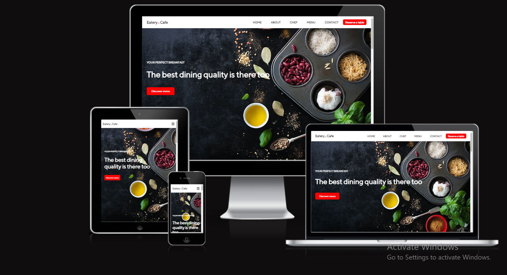
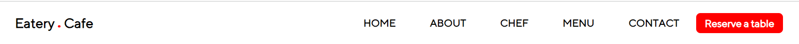
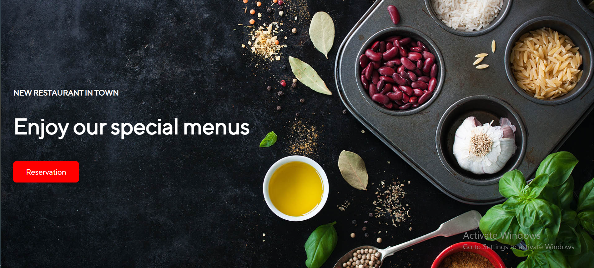
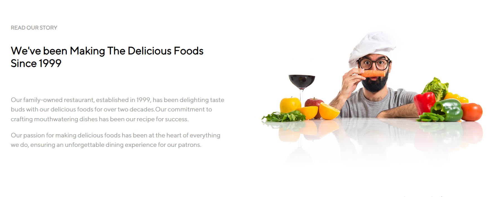
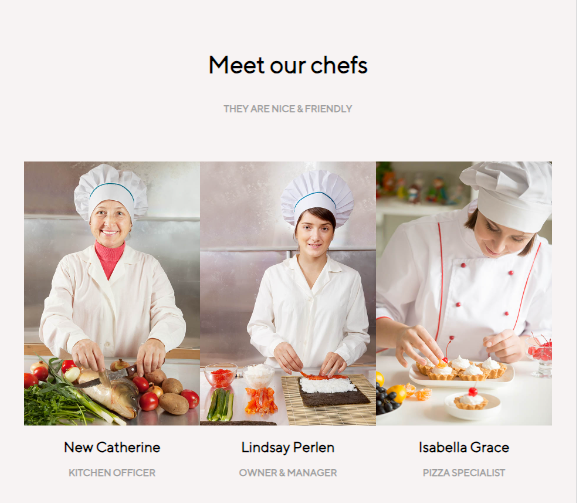
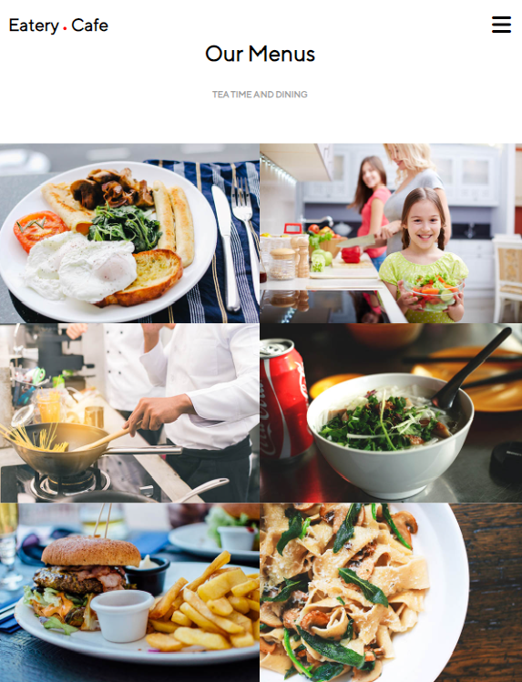
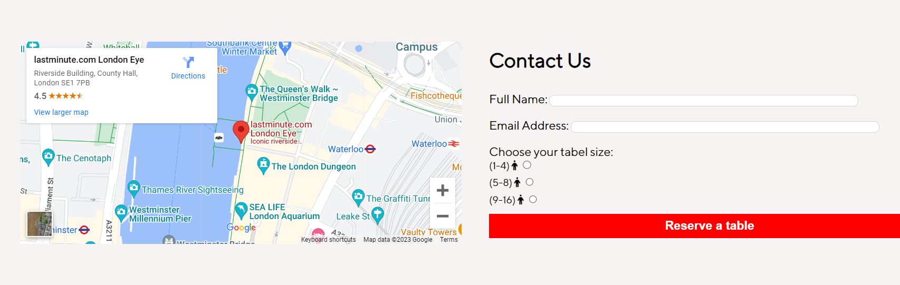
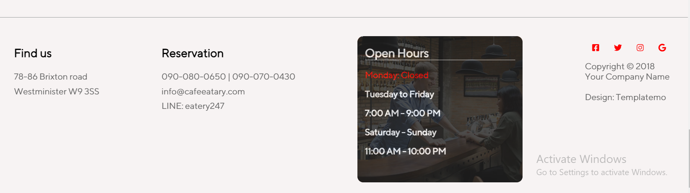

# it is my first project

Eatery Cafe is a distinguished London eatery, celebrated for its diverse and high-quality cuisine. Our restaurant is the ultimate destination for those seeking a delightful dining experience in a charming atmosphere, perfect for romantic evenings or gatherings with loved ones, with a spacious seating capacity for up to 50 guests.

[Am I responsive](https://ui.dev/amiresponsive?url=https://saba-baroughi.github.io/Final-Project-CI/)

# Existing Features

## Navigation Bar

Featured on a single page, the fully responsive navigation bar includes links to the Home, About, Chef, Menu, and Contact sections, with a fixed menu at the top of each section, allowing for effortless navigation.
This section will allow the user to easily navigate from page to page across all devices without having to revert back to the previous page via the ‘back’ button.
navbar image

## The landing page image

The landing page features a captivating photograph with text overlay and an eye-catching animation to grab the user's attention. The animation automatically changes the text every 6 seconds, allowing the user to experience different messages without having to click a button.

## About

The About section provides users with insight into the restaurant's history, portraying it as a family business. This narrative instills a sense of trust and familiarity, making visitors feel right at home.

## chef

The Chef section introduces users to the talented individuals responsible for crafting their meals. Users can also connect with the chefs through social media, fostering a sense of connection and appreciation for the culinary team.

## Menu

This section not only provides users with a general overview of the specialist menu but also encourages them, offering a sneak peek and insights to help them make informed decisions before their visit, including prices and a list of ingredients.

## Contact

This section provides the location and a reservation form, making it easy for users to find the restaurant's address and book their table.

## footer

The footer section includes links to relevant social media sites, opening times, and addresses. These links open in new tabs for easy user navigation. The footer is valuable as it encourages users to stay connected through social media.

